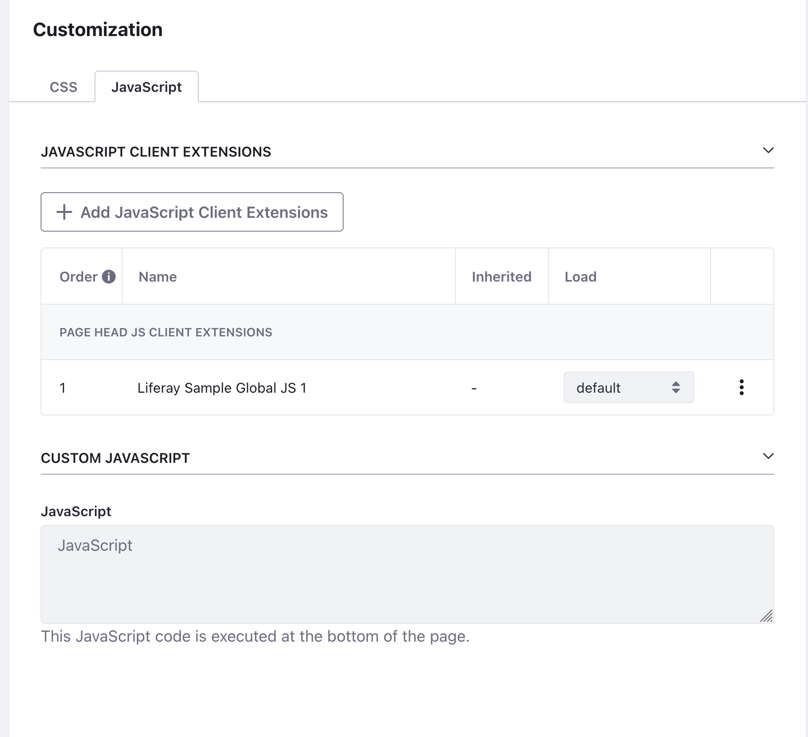

## Demo

This is a simple demo of how to use [window.postMessage](https://developer.mozilla.org/en-US/docs/Web/API/Window/postMessage) to communicate between an iframe and a parent page. It is very important to understand how postMessage works so that you can avoid any security issues.

### Some postMessage best practices

- [postMessage API](https://developer.mozilla.org/en-US/docs/Web/API/Window/postMessage)
- Don't communicate with domains you don't control.
- `window.addEventListener("message", receiveMessage);` recieves all postMessage events.
- postMessage allows for communication between...
  - two windows
  - parent and child frames
  - window and browser extensions
- Avoid passing auth tokens or other sensitive data without some sort of verification process.
- Use the `targetOrigin` option when sending messages.

## iframe-site

Run site locally with

```bash
cd ./iframe-site && npx serve
```

## Iframe Client Extension

You need to add the iframe client extension to your Liferay instance. You can do this in the UI and point the URL to your site you have running locally, likely `http://localhost:3000`.

## `bridge.js`

This is the client-side JavaScript that will be loaded into Liferay. You need to add this either via [globalJS client extension](https://learn.liferay.com/w/dxp/liferay-development/customizing-liferays-look-and-feel/using-a-javascript-client-extension) or just a global JS snippet on your page. This file is the "listener" for messages from the iframe-site. You can add any logic here as needed.


